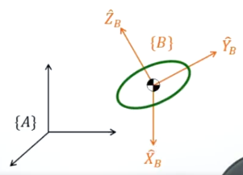

###机器人学（一）
####刚体(Rigid body)运动状态
>世界坐标系 world frame
刚体坐标系 body frame
自由度  DOF(degree of freedom)
位移 displacement
姿态 oriention
速度 velocity
加速度 acceleration

在刚体质心上建立坐标系后，利用各个DOF的微分，将位移和姿态转换到速度和加速度等运动状态

使用向量(vector) ***P***来描述{**B**}相对{**A**}的状态，可以用来表示空间中的绝对位置和刚体本身的位姿

从B坐标系变换到A坐标系的变换矩阵如下所示，可以通过B矩阵的X Y Z向量在A坐标系下X Y Z向量的单位投影得到
 
同时可以将前后向量互换得到另一种计算方法
 
通过转置矩阵可以实现A坐标系和B坐标系的自由变换，这种变换矩阵都是正定矩阵，转置矩阵就是逆矩阵
  

**Fixed Angles**:
1. 按照原来的坐标轴进行旋转
2. 旋转矩阵选择左乘
3. 一般按照X-Y-Z的顺序进行旋转

**Euler Angles**:
1. 按照每次旋转之后的新坐标进行旋转
2. 旋转矩阵选择右乘
3. 一般按照Z-Y-X的顺序进行旋转

对于两种旋转方法来说，如果X-Y-Z的旋转角度都相同，两种方法最终得到的旋转矩阵也相同(注意旋转顺序如上所示)

可以根据旋转矩阵***R***对每个坐标轴的旋转角度进行反推得到$\alpha,\beta,\gamma$，但对于Y轴旋转角度$\beta$是否为$90^\circ$，因为在$90^\circ$时会有奇异点得到多解

**Rotation Matrix**与转角小结：
1. Euler/Fixed Angles:12种旋转方法(第一次有三个旋转轴可选，第二次有两个，第三次有两个)
2. Angle-axis表达法： 直接确定一个目标向量，让现在的向量直接旋转过去，3DOFs
3. Quaternion(四元数)表达法：4个参数+1个限制条件，3DOFs
4.  